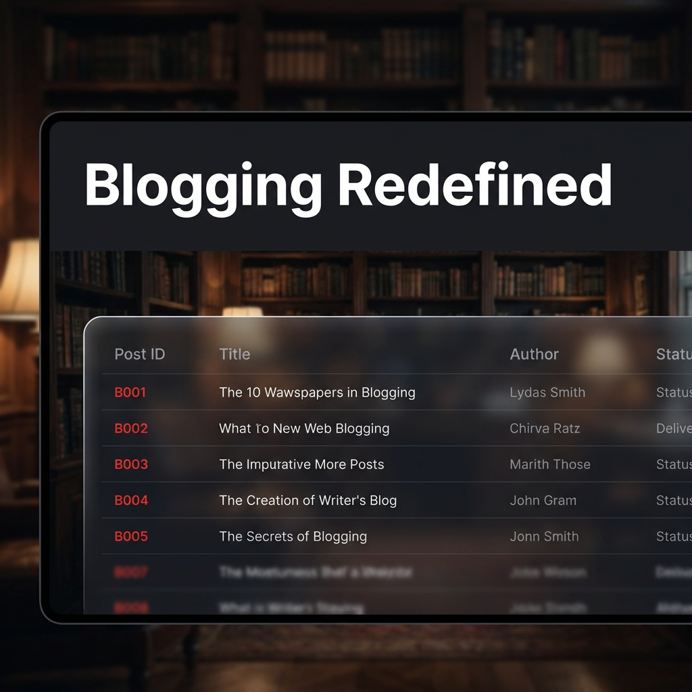
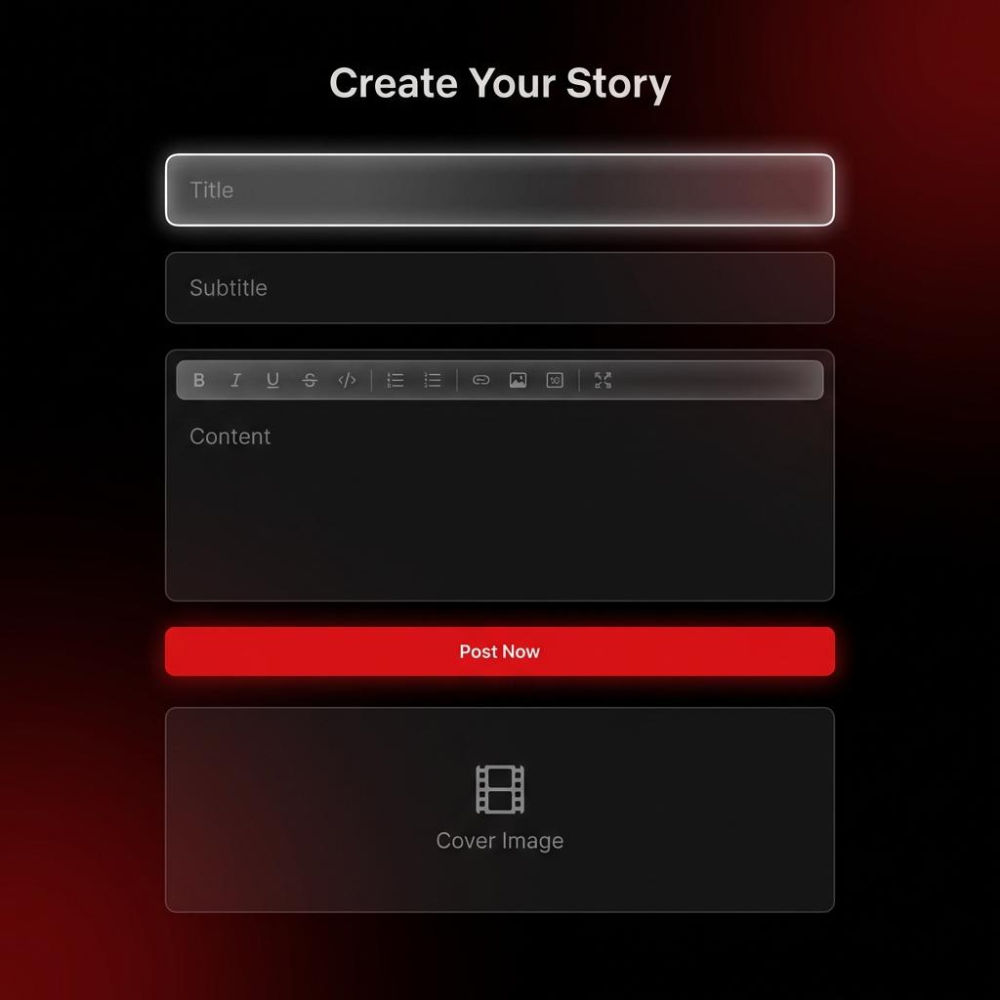

# 🎬 Netflix-Style Blogging Platform

A premium, cinematic full-stack blogging web application built with **Spring Boot** and **Thymeleaf**. This project features a high-end UI/UX inspired by the Netflix interface, complete with glassmorphism, cinematic typography, and smooth micro-animations.

---

## 📸 Project Previews

### 🏛 Cinematic Dashboard

*The main story hub featuring a glassmorphic "Story Stream" table and a cinematic ID-based action dashboard.*

### ✍️ Story Creation Form

*A sleek, minimalist post creation interface with custom glowing inputs and premium Netflix-red accents.*

---

## 🚀 Key Features

- **Cinematic UI/UX**: Professional Netflix-inspired dark theme with custom CSS variables.
- **Glassmorphic Components**: High-end blur effects and translucent borders for a modern feel.
- **Action Dashboard**: Manage stories instantly by ID with a custom cinematic search-style interface.
- **Full CRUD Operations**:
  - **Create**: Add stories via a dedicated premium form.
  - **Read**: View all stories in a "Story Stream" table with dynamic row rounding.
  - **Update**: Edit existing stories with pre-filled premium templates.
  - **Delete**: Instant removal feature with high-visibility branded buttons.
- **Responsive Design**: Fully optimized for various screen sizes using Bootstrap 5.
- **MVC Architecture**: Clean separation of concerns (Controller, Service, Repository, Model).

---

## 🛠 Tech Stack

- **Backend**: Java 21, Spring Boot 4.0.1
- **Database**: MySQL (with Spring Data JPA / Hibernate)
- **Frontend**: Thymeleaf, Bootstrap 5, Font Awesome, Google Fonts (Inter)
- **Styling**: Custom Vanilla CSS (Netflix Design System)
- **Build Tool**: Maven

---

## 🧱 Project Structure

```text
.
├── src/main/java/com/blog/BloggingProject/
│   ├── controller/      # Web Request Handlers
│   ├── model/           # Data Entities (Post)
│   ├── repository/      # Data Access Layer (MySQL)
│   └── servics/         # Business Logic Layer
├── src/main/resources/
│   ├── static/css/      # Custom Netflix Design System
│   └── templates/       # HTML5 / Thymeleaf Templates
└── assets/              # Premium UI Preview Mockups
```

---

## ⚡️ Quick Start

### 1. Database Setup
Ensure MySQL is running and create the database:
```sql
CREATE DATABASE Blogpost;
```

### 2. Configuration
Update `src/main/resources/application.properties` with your MySQL credentials:
```properties
spring.datasource.url=jdbc:mysql://localhost:3306/Blogpost
spring.datasource.username=YOUR_USERNAME
spring.datasource.password=YOUR_PASSWORD
```

### 3. Run the Application
```bash
mvn spring-boot:run
```
Access the dashboard at: `http://localhost:8080`

---

## 🎨 Design Philosophy
This project rejects the "basic table" approach in favor of a **Cinematic Experience**. By using **24px rounding**, **15px backdrop blurs**, and a carefully curated **Action Dashboard**, we bring a entertainment-industry feel to personal blogging.
